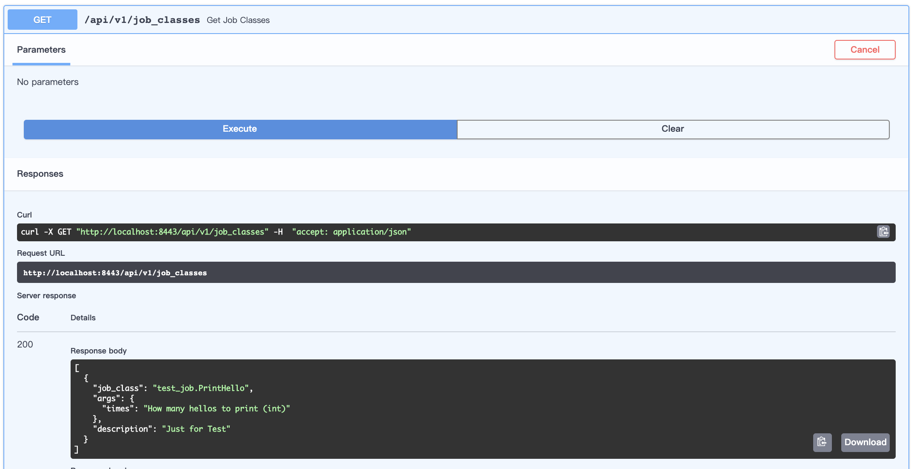
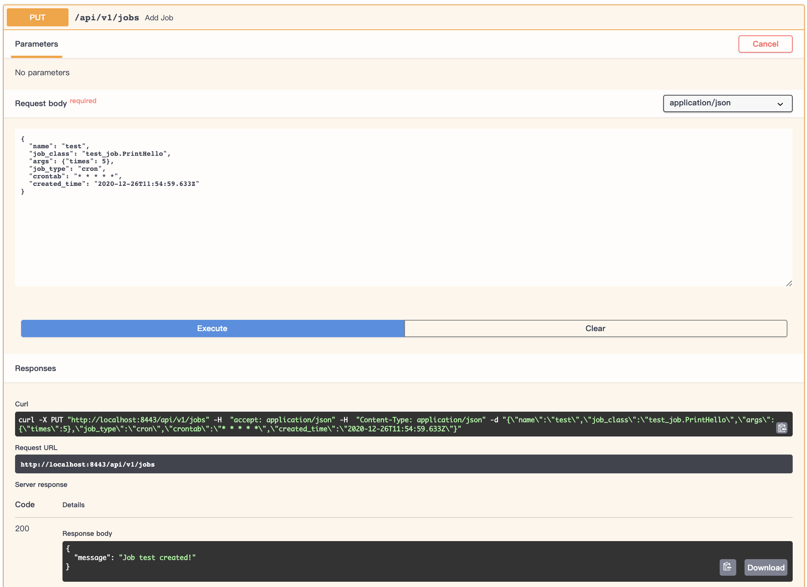
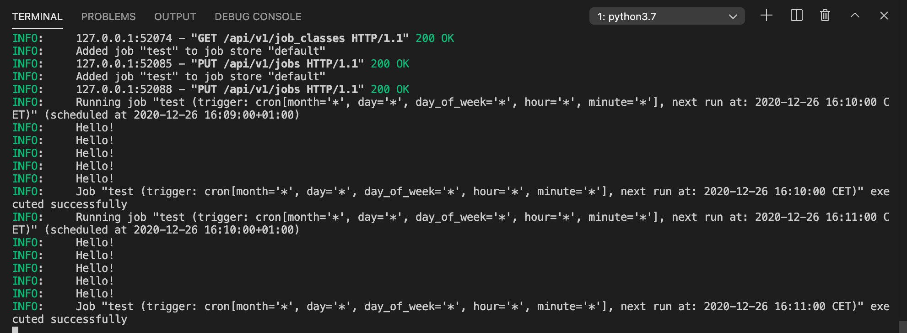

Title: Developing a Kubernetes Job Scheduler with FastAPI, apscheduler and Vue.js (Series: 01)
Date: 2020-12-26 10:01
Category: Machine Learning
Tags: python, API
Slug: My-second-post
Authors: Yang Yuchi
Summary: 

## Introduction

In recent years, the focus of machine learning in industry has strongly swifted from model exploration and hyper-parameter tuning to model productionization. After all, a model which just exists in Jupyter Notebook cannot be used by other applications in production environment.

There are a lot of articles and tutorials talking about how to serve a model as API with some kind of web framework like Flask, but only few talks about batch processing. Actually, there are many situations where serving model as API is not an economic choice. For example in my latest project, we only deliver the model predictions to frontend team once a day. Thus scheduling a cronjob is much more economic because compute resource is only allocated during job runtime.

However, developing a job scheduling system might not be as easy as you think. We not only want to just add a Kubernetes (Cron)Job, but also monitor job executions and collect results from multiple jobs (e.g. in model A/B test). 

In this series, I will go through all steps and details to develop a Kubernetes job scheduler and hope it can help.

## First FastAPI Application with a Job Scheduler

### Scheduler

Let's start with the scheduler module. [APScheduler](https://apscheduler.readthedocs.io/en/stable/) is a very powerful and easy to use package to schedule jobs in python. Since FastAPI is an asynchronous Web framework, we use **AsyncIOScheduler** in our project. After instantiation we directly call *start()* method so that our scheduler starts when this module is imported. Normally we have to define more options for the scheduler but for now we keep it simple.

**`./core/scheduler.py`**

```python
from apscheduler.schedulers.asyncio import AsyncIOScheduler

my_scheduler = AsyncIOScheduler()
```

### Job Class

Our scheduler calls `add_job()` method to add jobs, where we can specify which function we want to run in our job. But since we want to add jobs through API, it is important to have a general structure for all jobs, otherwise we have to write for each job a seperate endpoint with different parameters which soon burns us out. 

Here we define a Base class which specifies all components for a Job class. Basically each Job class should have a description and a set of parameters required by job functions. Besides, we have a `meta_info()` method to get those information and a `run()` method where the actuall work takes place.

**`./core/job/_base.py`**

```python
import abc

from pydantic import BaseModel

class JobBase(BaseModel, abc.ABC):
    description: str
    arguments: dict

    @classmethod
    def meta_info(cls):
        """Meta info of the job"""
        return {
            "job_class": f"{cls.__module__.split('.')[-1]}.{cls.__name__}",
            "arguments": cls.__fields__["arguments"].get_default(),
            "description": cls.__fields__["description"].get_default(),
        }

    @abc.abstractmethod
    async def run(**kwargs):
        """Each Job must has a run() method"""
        raise NotImplementedError("Job must has a run method!")
```

Here is an example job:

**`./core/job/test_job.py`**

```python
import logging
from ._base import JobBase

logging.basicConfig(level=logging.INFO)

class PrintHello(JobBase):
    description: str = "Just for Test"
    arguments: dict = {
        "times": "How many hellos to print (int)",
    }

    @classmethod
    async def run(cls, **kwargs):
        args = kwargs["args"]
        for i in range(int(args["times"])):
            logging.info("Hello!")
```

In order to manage all job classes together and make it easier for module importation,  we add the following content in `__init__.py`. 

**`./core/job/__init__.py`**

```python
import pathlib
from importlib import import_module
from inspect import isclass
from pathlib import Path
from pkgutil import iter_modules

from ._base import JobBase

# https://julienharbulot.com/python-dynamical-import.html
package_dir = str(Path(__file__).resolve().parent)
for (_, module_name, _) in iter_modules([package_dir]):

    module = import_module(f"{__name__}.{module_name}")
    for attribute_name in dir(module):
        attribute = getattr(module, attribute_name)
        if isclass(attribute):
            globals()[attribute_name] = attribute
```

FastAPI utilizes Pydantic models to validate schemas of API calls. Thus we also need to define schemas for Job creation. To create a job, we need to specify a name, the job_class, arguments, job_type (cron or single) and crontab. Creation time will be assigned later during job creation in our endpoint.

**`./schemas/job.py`**

```python
from datetime import datetime
from datetime import datetime
from enum import Enum

from pydantic import BaseModel

class TypeEnum(str, Enum):
    cron = "cron"
    single = "single"


class ActionEnum(str, Enum):
    resume = "resume"
    pause = "pause"


class JobCreate(BaseModel):
    name: str
    job_class: str
    args: dict
    job_type: TypeEnum
    crontab: str
    created_time: datetime = None
```


### Endpoints

Now we are ready to implement endpoints to query job classes and add/list/delete jobs. 

Before adding a job, we may need to query which job classes are availble through the `/job_classes` endpoint.

**`./api/api_v1/api.py`**

```python
from fastapi import APIRouter

from .endpoints import job_classes, jobs

api_router = APIRouter()
api_router.include_router(jobs.router, prefix="/jobs")
api_router.include_router(job_classes.router, prefix="/job_classes")

```

**`./api/api_v1/endpoints/job_classes.py`**

```python
from fastapi import APIRouter
from ....core.jobs import JobBase

router = APIRouter()

@router.get("")
async def get_job_classes():
    return [j.meta_info() for j in JobBase.__subclasses__()]
```

The `/jobs` endpoint handles all operations of jobs, including adding a job, deleting a job, change job state and list jobs.

**`./api/api_v1/endpoints/jobs.py`**

```python
from datetime import datetime
from enum import Enum
from uuid import uuid4

from apscheduler.triggers.cron import CronTrigger
from fastapi import APIRouter, Body, HTTPException
from sqlalchemy import desc
from sqlalchemy.orm import Session

from ....core.database import SessionLocal
from ....core.jobs import JobBase
from ....core.scheduler import my_scheduler
from ....schemas.job import ActionEnum, JobCreate
from ....utils import generate_uuid

router = APIRouter()
db: Session = SessionLocal()


@router.put("")
async def add_job(job: JobCreate):
    job_class = next(
        (
            j for j in JobBase.__subclasses__()
            if j.meta_info()["job_class"] == job.job_class
        ),
        None,
    )
    if not job_class:
        return {"message": f"Job Class {job.job_class} not found!"}
    
    job_id = generate_uuid(8)
    job.created_time = datetime.now()
    if job.job_type == "cron":
        trigger = CronTrigger.from_crontab(job.crontab)
        my_scheduler.add_job(
            job_class.run,
            trigger,
            id=job_id,
            name=job.name,
            kwargs=job.dict()
        )
    else:
        my_scheduler.add_job(
            job_class.run,
            id=job_id,
            name=job.name,
            kwargs=job.dict(),
            next_run_time=None,
            misfire_grace_time=3600,
        )
    return {"message": f"Job {job.name} created!"}


@router.get("")
async def get_jobs():
    job_list = []
    for job in my_scheduler.get_jobs():
        job_list.append(
            {
                "id": job.id,
                "name": job.name,
                "job_class": job.kwargs["job_class"],
                "created_time": job.kwargs["created_time"].strftime(
                    "%a, %d %b %Y %H:%M:%S %Z"
                ),
                "nextrun": job.next_run_time.strftime(
                    "%a, %d %b %Y %H:%M:%S %Z" 
                ) if job.next_run_time else None,
                "schedule": job.kwargs["crontab"] if job.kwargs["job_type"] == "cron" else "SINGLE",
                "status": "RUNNING" if job.next_run_time else "PAUSED",
            }
        )
    
    return job_list


@router.post("/{job_id}")
async def modify_job_state(job_id: str, action: ActionEnum = Body(..., embed=True)):
    if action ==  ActionEnum.pause:
        job = my_scheduler.pause_job(job_id)
        return {"message": f"Job {job.name} paused!"}
    else:
        job = my_scheduler.resume_job(job_id)
        return {"message": f"Job {job.name} resumed!"}


@router.delete("/{job_id}")
async def delete_job(job_id: str):
    job = my_scheduler.get_job(job_id)
    if not job:
        raise HTTPException(status_code=404, detail="Job not exists!")
    my_scheduler.remove_job(job_id)
    return {"message": f"Job {job.name} deleted!"}
```


### Main APP

Now all things we have to do is including the endpoints into our FastAPI main app. 

**`./main.py`**

```python
import uvicorn
from fastapi import FastAPI
from .core.scheduler import my_scheduler
from .api.api_v1.api import api_router

app = FastAPI()
app.include_router(api_router, prefix="/api/v1")
    
@app.on_event("startup")
async def start_scheduler():
    my_scheduler.start()


if __name__ == "__main__":
    uvicorn.run(app, host="0.0.0.0", port=8443)
```


### Test our First Scheduler

Now in root path (here my code are inside the `backend/app` folder), run 

``uvicorn backend.app.main:app --reload --host 0.0.0.0 --port 8443``

to start the web app and open the Swagger UI in browser under url `http://localhost:8443/docs`

**Get available job classes**



**Add cronjob**



Here we added a job which prints hello every minute, we can see it in our terminal output.



We can also list current jobs and delete a job by its job_id in the Swagger UI. 

So, that's it! We have implemented our first job scheduler :)

In the next post of this series I will show you how to use job event listener and a database to monitor job executions. 