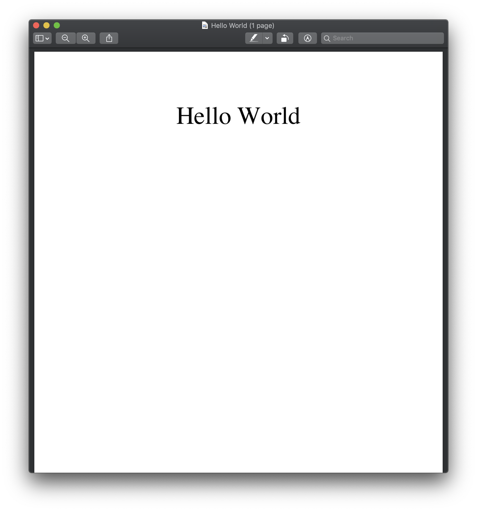
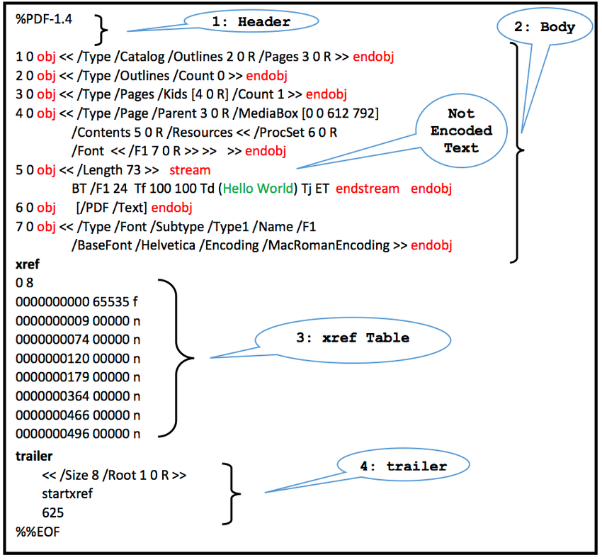

Title: Understand the PDF Format
Date: 2019-09-15 10:01
Category: NLP
Tags: pdf, nlp, python, text mining
Slug: My-first-post
Authors: Yang Yuchi
Summary: What does your post talk about? Write here.

## 1. Introduction

[**PDF (Portable Document Format)**](https://en.wikipedia.org/wiki/PDF) is one of the most widely used file format in our daily life. Developed in the 1990s by Adobe, it aims to present documents in an easy and stable manner, independent of the applications and operating systems. This matches our impression: no matter we view a PDF document on Macbook or on Windows laptops, with Adobe Reader or Mac Preview, its appearance barely changes. As comparison, if we write a *.doc* Word document in Windows and open it with Pages in Mac OS, we often have problems with format, font etc. 

People often feel that PDF and other document file formats such as Word are similar, but in essence there's huge difference between them. In this article I will explain why PDF is so stable, what a PDF file consists of and how we can utilize these knowledge to extract text from PDF documents using Python. 

## 2. How PDF Display Texts

Maybe you have already noticed that when generating PDF documents, softwares often use words like "**Export**" or "**Print**". This indicates that the editing stage should already be finalized before the "Export". Once the document is "printed" out, we would not like to change the content any more. **In fact, the process of "printing" a PDF document is just like how printers print a paper in the real world.** 

To understand how PDF files are "printed", we create a Word document with a single line "Hello World" aligned to the middle and export it as PDF. 

<center class="half">

</center>


Let's see how Word realizes the above display. We can decompress the ` HelloWorld.doc` file (yes, like .rar files, it's a compressed package) and find the file `word/document.xml`. It regulates how this line of text is displayed. Here we have picked out some of the most important snippets.

````xml
<w:pPr>
  <w:jc w:val="center"/>
  <w:rPr>
    <w:rFonts w:ascii="Times" w:hAnsi="Times"/>
    <w:sz w:val="72"/><w:szCs w:val="72"/>
  </w:rPr>
</w:pPr>
<w:r>
  <w:rPr>
    <w:rFonts w:ascii="Times" w:hAnsi="Times"/>
    <w:sz w:val="72"/><w:szCs w:val="72"/>
  </w:rPr>
  <w:t>Hello World</w:t>
</w:r>
````

Like HTML, XML is a **Markup Language**: it uses different **tags** to wrap the text and **describes** its characteristics, in the example above we see font *Times* and alignment *center* are tagged to text *Hello World*. Using markup language is pretty like giving orders to human: "hey, please write the text 'Hello World' with Times font and align it to the center". This sounds easy but actually lacks of precision. Different softwares may use different ways to interpret this order: How to align the text? What if we don't have Times font? Where should be "*the center*"?  

**With PDF format, we don't have those concerns at all.** Other than **descriptive** markups,  PDF format uses an **absolute**, **command-like** language to render texts. Let's open our Hello Word PDF document with PyPDF2 package and see what's going on.

```python
import PyPDF2
pdf = PyPDF2.PdfFileReader(open('Hello_World.pdf', 'rb'))
page = pdf.getPage(0)
print(page, "\n")
print(type(page['/Contents']))
print(page['/Contents'].getData())
```

<pre>{'/Type': '/Page', '/Parent': IndirectObject(3, 0), '/Resources': IndirectObject(6, 0), 
'/Contents': IndirectObject(4, 0), '/MediaBox': [0, 0, 595, 842]}

<class 'PyPDF2.generic.EncodedStreamObject'>
b'q Q q /Cs1 cs 0 0 0 sc q 0.24 0 0 0.24 18 621.92 cm BT 150 0 0 150 787 481\nTm /TT1 1 Tf [
(H) 2 (e) -2.7 (l) -2 (l) -2 (o ) 3.3 (W) -2.7 (or) -0.3 (l)\n-2 (d) ] TJ ET Q q 0.24 0 0 
0.24 18 621.92 cm BT 150 0 0 150 1541 481 Tm /TT1\n1 Tf ( ) Tj ET Q Q'</pre>

Here we read the PDF file in binary mode. The *getPage()* method returns a PageObject containing all contents and resources of a page, which are saved as dictionary. Text content is a **EncodedStreamObject** which can be accessed via *page['/Contents'].getData()*. We select and rearrange the content as follows: 

````
BT
150 0 0 150 787 481 Tm
/TT1 1 Tf
[(H) 2 (e) -2.7 (l) -2 (l) -2 (o ) 3.3 (W) -2.7 (or) -0.3 (l) -2 (d) ] TJ
ET
````

Basically, the content consists of a sequence of **instructions** describing the graphical elements to be painted on a page. Each instruction has an operant and an operator. Details of these operators can be found in the [offical pdf documentation](https://www.adobe.com/content/dam/acom/en/devnet/pdf/pdfs/PDF32000_2008.pdf). Let's translate the above instructions into human language: 

1. Use BT operator to indicate begin of text; 
2. Use Tm operator to set the text matrix, where (787, 481) indicates the position; 
3. Use Tf operator to set the font to refer to /TT1, with text font size 1; 
4. Use TJ operator to show the text, allowing individual glygh positioning, where the numbers are position offsets, this kind of denoting is especially useful for [text kerning](https://en.wikipedia.org/wiki/Kerning);
5. Use ET operator to indicate end of text.

Now we see the difference from the *.doc* format. The "language" of PDF format is very low level. Instead of using vague words like "center", it moves to the absolute coordinate on the paper to draw the text; instead of telling the software to use "Times" font, it directly refers to the font object ''/TT1'' which is embedded as part of the document. It even uses precise offsets for each glyph when rendering text.

This well explains why PDF format is stable and portable. On one hand, it uses **absolute instructions** other than **ambigous descriptions**. No matter using which software, it always goes to the exact positions on the paper to draw the text. On the other hand, it embeds all resources required to draw the content, like the  "/TT1" FontObject used in our document.

In the following section we will take a closer look at the structure of PDF format.

## 3. Structure of PDF Format



The structure of PDF file consists of four parts, as shown in the above figure:

* **Header**: a line preceded by a comment sign (%) and then the version number of the PDF document. 
* **Body**: this is the main content of the PDF document, which encompasses different objects, such as image data, fonts and text streams. Some of the objects might be invisible (e.g. kryptographic passwords). 
* **Cross-Reference Table** (also called **xref Table**): it contains links (byte offsets) to all objects in the file, which can be used to navigate to contents in a document. By looking at the entries in this table, a PDF reader can easily locate an object within the file. This table will be automatically updated when there are changes in the file. 
* **Trailer**: The trailer contains offset of cross-reference table and always ends up with "%%EOF" to mark the end of a PDF file. 

When a PDF reader opens the file, it first determines the file type and version number from the header, then directly goes to the trailer to get the location of the xref table. According to the xref table, it can get the location of each object and the reference relationship between them.

Our document has the same structure, we can validate this by opening it as binary file as print its contents. (Here we only print the first 500 and last 1000 bytes to make it shorter)

````python
with open('Hello_World.pdf', 'rb') as f:
    data = f.read()
    print(data[:500])
    print('-' * 90)
    print(data[-1000:])
````

<pre>b'%PDF-1.3\n%\xc4\xe5\xf2\xe5\xeb\xa7\xf3\xa0\xd0\xc4\xc6\n4 0 obj\n<< /Length 5 0 R /Filter 
/FlateDecode
>>\nstream\nx\x01\x8d\x8e1\x0f\x82@\x0c\x85w~\xc57\xde\r\x1e\xd7\x03\x04W\x8d\x89q#i\xe2`\x9
cP\x07\x02!\xc8\xffO\xe4@\x9dM\x87\xf7\xfa\xda\xb4\xdfH\xcdHz\x98\x84f\xc2/55s\xe4]\xc8\xd7>
\x1a\xa9\xd8\x06q\xbb@\xd3\xb3W\xa4XW\xa3\x96UI^I\xa2=\xa9\xaa 
\xe8\x93+\xe6d\t\x98\x87e\x13\\\x89\xe9\xa2\xf9\xc9\x80%s\x19\xe6\xf2\x9d\x0f\xaf\xd9\xf9\x1
8u6\x89\x9bw\xcb\r=s\xd4\x85\xf1\x7f 
)r\x89D|\x88\x92\x85\xc8\xcc\x1f\xb5]\xaf\xd5o\xeb\x0c3\x0b\nendstream\nendobj\n5 0 
obj\n149\nendobj\n2 0 obj\n<< /Type /Page /Parent 3 0 R /Resources 6 0 R /Contents 4 0 R 
/MediaBox [0 0 595 842]\n>>\nendobj\n6 0 obj\n<< /ProcSet [ /PDF /Text ] /ColorSpace << /Cs1
7 0 R >> /Font << /TT1 8 0 R\n>> >>\nendobj\n9 0 obj\n<< /Length 10 0 R /N 3 /Alt'
------------------------------------------------------------------------------------------
b'Version 10.14.6 \\(Build 18G95\\) Quartz PDFContext)\nendobj\n17 0 
obj\n(\xfe\xffgh[\x87\x9ap)\nendobj\n18 0 obj\n()\nendobj\n19 0 obj\n(Word)\nendobj\n20 0 
obj\n(D:20191005174709Z00'00')\nendobj\n21 0 obj\n()\nendobj\n22 0 obj\n[ ]\nendobj\n1 0 
obj\n<< /Title 15 0 R /Author 17 0 R /Subject 18 0 R /Producer 16 0 R /Creator\n19 0 R 
/CreationDate 20 0 R /ModDate 20 0 R /Keywords 21 0 R /AAPL:Keywords\n22 0 R 
>>\nendobj\nxref\n0 23\n0000000000 65535 f \n0000009404 00000 n \n0000000264 00000 n 
\n0000003235 00000 n \n0000000022 00000 n \n0000000245 00000 n \n0000000368 00000 n 
\n0000003200 00000 n \n0000003368 00000 n \n0000000465 00000 n \n0000003179 00000 n 
\n0000003318 00000 n \n0000003723 00000 n \n0000003976 00000 n \n0000009129 00000 n 
\n0000009150 00000 n \n0000009180 00000 n \n0000009254 00000 n \n0000009281 00000 n 
\n0000009300 00000 n \n0000009323 00000 n \n0000009365 00000 n \n0000009384 00000 n 
\ntrailer\n<< /Size 23 /Root 11 0 R /Info 1 0 R /ID [ 
<ae4870440264b01443903d5b90f080f3>\n<ae4870440264b01443903d5b90f080f3> ] 
>>\nstartxref\n9579\n%%EOF\n' </pre>

Here we can clearly see all the four parts of a PDF document. Apart from them, there are several things worth noticing:

1. A PDF file is an **ASCII** file, except for certain elements that have binary contents. Thus when we open a PDF in binary mode, most contents are human-readable because python automatically prints bytes within ASCII range as characters. Bytes shown as hex numbers are mostly content in a stream which cannot be decoded directly with ASCII. 

2. There are lots of references inside the file, they appear in form of `n 0 R` where n is the ID of the object it refers to, whereas objects have the form `n 0 obj endobj`. For example, when we look at the "/Creater", instead of using the actual content, it just refers to the object `19, 0, R`. Look a little bit upwards, we can find how this object is defined: a string "Word" because this pdf is exported from MS Word Application `19 0 obj\n(Word)\nendobj`.


Since the objects in a PDF file are highly dependent on each other, we should avoid altering contents of a pdf file. Imagine these objects as Lego bricks, moving one brick away can cause the entire structure to be destroyed. Even adding building blocks is expensive because other blocks also need to be adjusted. Remember, PDF format is designed for displaying and transporting, not for editing, like we don't want to alter content on a printed paper document. 

## 4. Extract Text from PDF File

In the domain of Text Mining, text data are often not directly available. Text data may come from a variety of sources, including PDF documents. Based on the knowledge we learn in previous sections, we will have a look at how to extract text from PDF documents using python.  

###4.1 Embedded Text

When text is embedded in the file, we can parse the operations and operators in the stream to get the text. With PyPDF2, we can use the *extractText()* method.

````python
import PyPDF2
pdf = PyPDF2.PdfFileReader(open('Hello_World.pdf', 'rb'))
page = pdf.getPage(0)
print(page.extractText())
````

````
Hello World

````

The *extractText()* method first get the content object from the page and convert it into a ContentStream. This ContentStream parses all operants and operators and save them into a list. When extracting text, the programm examines every operation and do actions according to the operator, e.g. if the operator is "TJ" like in our case, the programm go through each glygh and append them to the text. The source code for this method is as follows:

````python
def extractText(self):
    text = u_("")
    content = self["/Contents"].getObject()
    if not isinstance(content, ContentStream):
        content = ContentStream(content, self.pdf)
    for operands, operator in content.operations:
        if operator == b_("Tj"):
            _text = operands[0]
            if isinstance(_text, TextStringObject):
                text += _text
                text += "\n"
        elif operator == b_("T*"):
            text += "\n"
        elif operator == b_("'"):
            text += "\n"
            _text = operands[0]
            if isinstance(_text, TextStringObject):
                text += operands[0]
        elif operator == b_('"'):
            _text = operands[2]
            if isinstance(_text, TextStringObject):
                text += "\n"
                text += _text
        elif operator == b_("TJ"):
            for i in operands[0]:
                if isinstance(i, TextStringObject):
                    text += i
            text += "\n"
    return text
````

#### Problems of extractText() method

* **Lack layout analysis**

As we see in the source code, there's no support for some important operators, such as "*Tm*" and "*Td*". This can lead to problematic layout. I have seen pdf documents which use *Tj* operator to show texts and *Tm* operator to move to next position like below:

```
BT
/F2 11 Tf
1 0 -0 1 62.35 640.85 Tm
Hello Tj
ET
BT
1 0 -0 1 62.35 630.35 Tm
World Tj
ET
```

If we use *extractText()* to extract the text, the whitespace between "Hello" and "World" will be missing because it is implictly added by moving the coordinate with *Tm* operator.

A good alternative is the [pdfminer](https://github.com/pdfminer/pdfminer.six) package. It supports much more powerful text extraction functionality with precise layout analysis. It handles almost every kind of operator and records the coordinate of each single character.

* **Lack unicode mapping**

Some [Unicode Fonts](https://en.wikipedia.org/wiki/Unicode_font) don't use ASCII to encode and decode characters. As a test, if we write our "Hello World" with Arial font in Word and export to PDF, *extractText()* can't decode the text correctly.

````python
import PyPDF2
pdf = PyPDF2.PdfFileReader(open('Hello_World_Arial.pdf', 'rb'))
page = pdf.getPage(0)
print(page.extractText())
````

````
!"##$%&$'#(
%
````

Instead of "Hello World", what we see are some strange characters. When we inspect the content of the font, it has an additional "/ToUnicode" feature which Times font doesn't have.

````python
tt2 = page['/Resources']['/Font']['/TT2'].getObject()
print(tt2.items())
````

````
dict_items([('/Type', '/Font'), ('/Subtype', '/TrueType'), ('/BaseFont', 
'/HBUUFJ+ArialMT'), ('/FontDescriptor', IndirectObject(13, 0)), ('/ToUnicode', 
IndirectObject(14, 0)), ('/FirstChar', 33), ('/LastChar', 40), ('/Widths', [722, 556, 
222, 556, 278, 944, 333, 556])])
````

````python
print(tt2['/ToUnicode'].getData())
````

````
b'/CIDInit /ProcSet findresource begin\n12 dict begin\nbegincmap\n/CIDSystemInfo <<\n  
/Registry (Adobe)\n  /Ordering (UCS)\n  /Supplement 0\n>> def\n/CMapName /Adobe-Identity-
UCS def\n/CMapType 2 def\n1 begincodespacerange\n<00><FF>\nendcodespacerange\n8 
beginbfrange\n<21><21><0048>\n<22><22><0065>\n<23><23><006c>\n<24><24><006f>\n<25><25>
<0020>\n<26><26><0057>\n<27><27><0072>\n<28><28><0064>\nendbfrange\nendcmap\nCMapName 
currentdict /CMap defineresource pop\nend\nend\n'
````

Inside the "/ToUnicode" object, we can find a so-called CMap which maps Char IDs to Unicode UTF-16BE character. When decoding the bytes, the program should map the original ID to Unicode to get the correct results. In the above example, the original byte of "!" is *0x21* (because ASCII code of "!" is decimal 33, hexadecimal 21), which should be mapped to *0x0048* (decimal 72), corresponding to the character "H". Similarly we can decode other bytes according to the CMap and get the correct result.

We can use CMapParser and FileUnicodeMap in pdfminer package to parse above font stream.

````python
import io
from pdfminer.cmapdb import CMapParser, FileUnicodeMap
cmap = FileUnicodeMap()
CMapParser(cmap, io.BytesIO(tt2['/ToUnicode'].getData())).run()
print(cmap.cid2unichr)
````

````
{33: 'H', 34: 'e', 35: 'l', 36: 'o', 37: ' ', 38: 'W', 39: 'r', 40: 'd'}
````

Having this CMap, we can decode the bytes correctly:

````python
import struct
text = ""
for cid in struct.iter_unpack('b', b"!\"##$%&$'#("):
    text += cmap.get_unichr(cid[0])
print(text)
````

````
Hello World
````


You may ask why do we still use PyPDF2, if pdfminer works better than it? Well, my experience is that both tools are quite good but not perfect. It really depends on your situation, as the structure of pdf documents can be very complicated in real scenarios. There are situations where PyPDF2 outperforms pdfminer as well, and PyPDF2 is more extendable if you want to overwrite some functions.

Another popular tool is the command-line based [pdftotext](https://www.xpdfreader.com/pdftotext-man.html), which is part of the Xpdf software suite. In some of my experiments it works better than the other two python packages.

### 4.2 Text in Images

In some PDF documents, texts are not embedded as content streams, but as images. For example if we scan a book and save the pages as pdf, the texts cannot be directly extracted using previous methods. In this situation, we should use OCR tools such as [Tesseract](https://github.com/tesseract-ocr/tesseract) to extract text from images. 

After installing Tesseract, we can use it in python with the [pyocr](https://gitlab.gnome.org/World/OpenPaperwork/pyocr) package, often used together with [Pillow](https://github.com/python-imaging/Pillow).  An example:

````python
import pyocr
from PIL import Image
with Image.open("xxx.png") as img:
    tool = pyocr.get_available_tools()[0]  # 0 for tesseract
    text = tool.image_to_string(img, lang='eng')
````

Normally we can first convert PDF pages to images using [pdftopng](https://www.xpdfreader.com/pdftopng-man.html) or extract images using [pdfimages](https://www.xpdfreader.com/pdfimages-man.html) then apply OCR to images. 

Another approach is to build PIL.Image objects directly from raw bytes and do text extraction on the fly. In PDF documents, Images are integrated as XObjects which can be accessed via PyPDF2 like this:

````python
obj = pdf.getPage(PAGE_ID)['/Resources']['/XObject'][NAME_OF_OBJECT]
````

Images are typically encoded for compression purpose. Reconstructing image from raw bytes is non-trivial. You can take a look at this question on StackOverflow [Extract images from PDF without resampling, in python?](https://stackoverflow.com/questions/2693820/extract-images-from-pdf-without-resampling-in-python)

